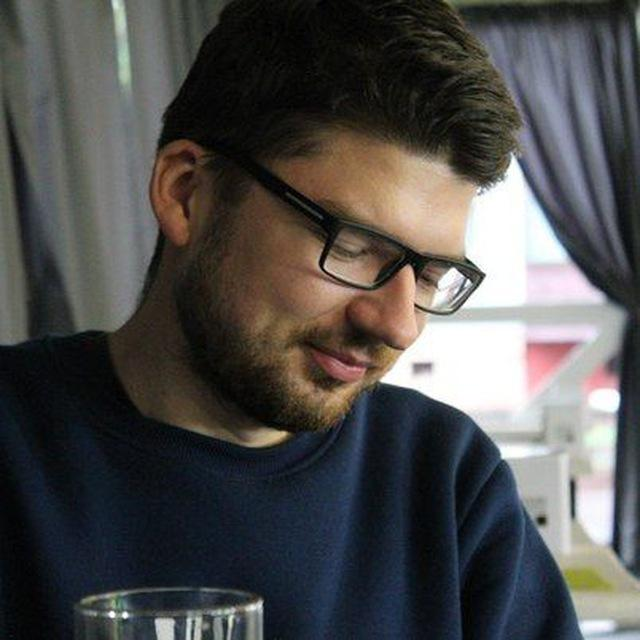

# Yasinsky Vladimir

## Web developer




## Contacts
* **Location:** Gomel, Belarus
* **Phone:** +375 (44) 754 78 39
* **Email:** yasinsky2015@gmail.com
* **LinkedIn**: [link](https://www.linkedin.com/in/uladzimir-yasinski-810771173)

## Education

### Suchoi State Technical University
*Faculty of energy*

## Courses
1. [HTML Academy](https://htmlacademy.ru/)
2. [Udemy courses](https://www.udemy.com/ru/courses/it-and-software/)

## Experience

* ### Brymonsoft
  *Work  as a backend developer*
  > Preferred db: mongodb. Redis was used to implement work queues.
  > Frameworks: express, moleculer, nest.
  > Socket.io was used for notifications and real-time chat,
  > luis intents were also used to
  > handle user messages and automatic replies.
* ### EPAM Systems
  *Worked as electrical engineer*


## Skills
* Node js
* MongoDb
* PostgreSQL
* Express
* Nest
* WebSocket
* Elastic Search
* Docker
* Git
* HTML
* CSS

## Code example

```javascript
function getMissingElement(superImportantArray){
    for(let i = 0; i < 10; i++) {
        if(!superImportantArray.includes(i)) return i;
    }
}
```

## Hobbies
> I play guitar in a rock-band. I also like to listen to
good music, watch  good movies,
play good games and  laugh at good humor.

## Languages
* Russian - Native
* English - Elementary


